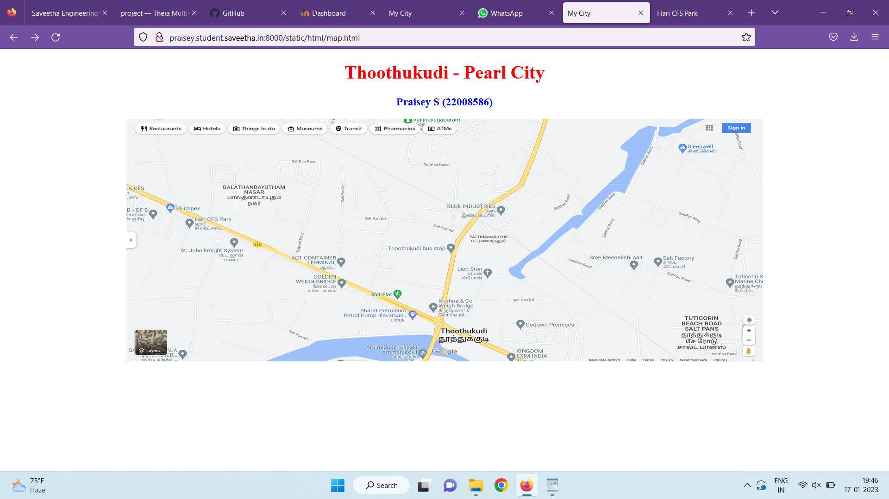
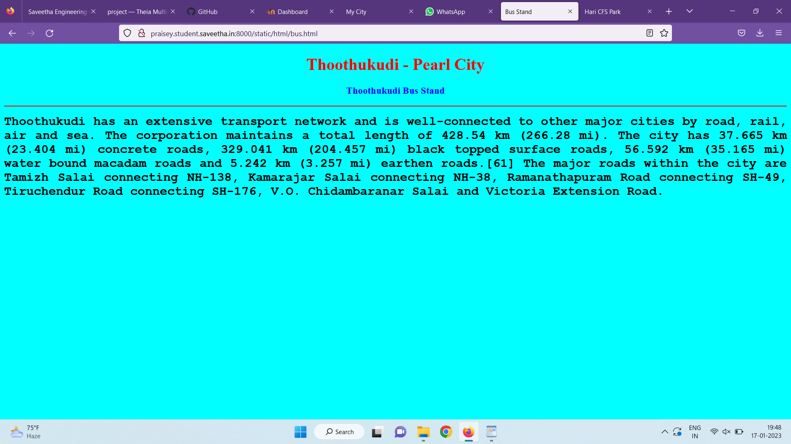
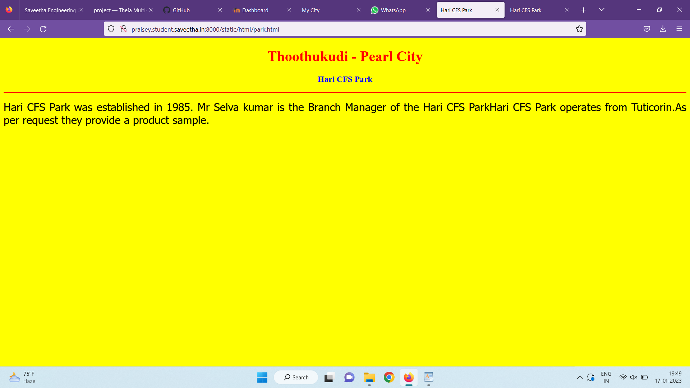
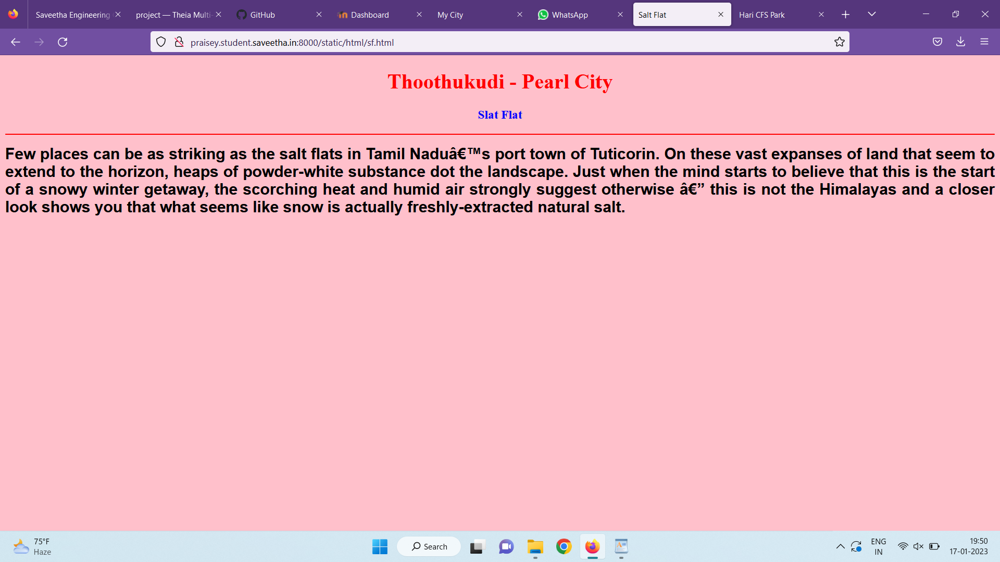
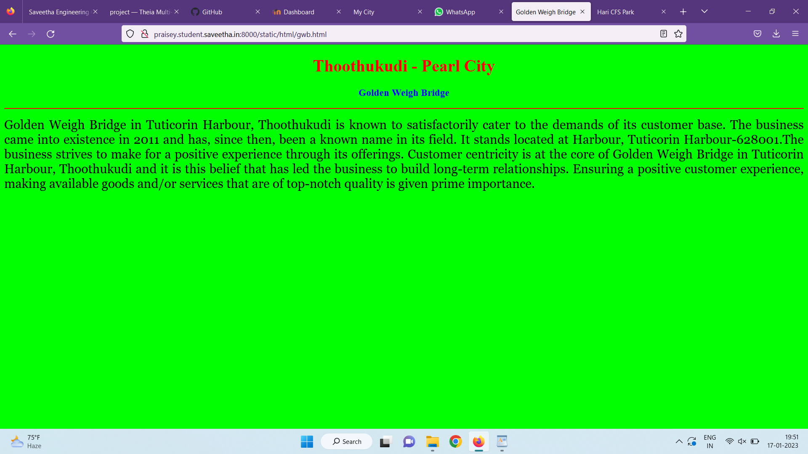
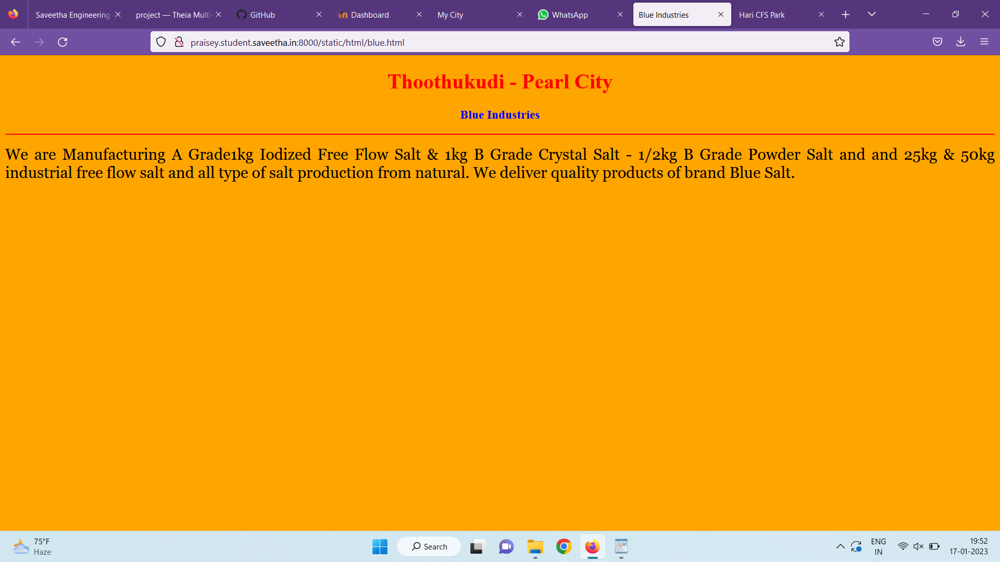
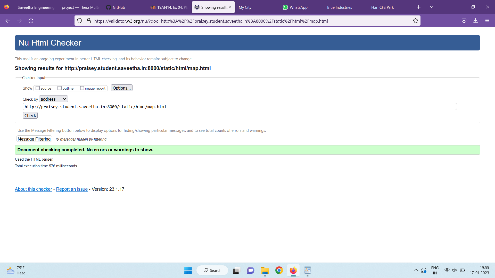

# Places Around Me
## AIM:
To develop a website to display details about the places around my house.

## Design Steps:

### Step 1:
Clone the github repository into Thiea IDE.

### Step 2:
Create a new Django project

### Step 3:
Write the needed HTML code.

### Step 4:
Run the Django server and execute the HTML files.

## Code:
```
map.html
<!DOCTYPE html>
<html lang="en">
<head>
<title>My City</title>
</head>
<body>
<h1 align="center">
<font color="red"><b>Thoothukudi - Pearl City</b></font>
</h1>
<h3 align="center">
<font color="blue"><b>Praisey S (22008586)</b></font>
</h3>
<center>

<map name="MyCity">
<area shape="circle" coords="645,325,651,325" href="/static/html/bus.html" title="Thoothukudi Bus Stop">
<area shape="rectangle" coords="535,413,540,413" href="/static/html/sf.html" title="Salt Flat">
<area shape="circle" coords="418,413,424,418" href="/static/html/gwb.html" title="Golden Weigh Bridge">
<area shape="circle" coords="122,256,128,256" href="/static/html/park.html" title="Hari CFS Park">
<area shape="rectangle" coords="744,215,750,215" href="/static/html/blue.html" title="Blue Indestries">
</map>
</center>
</body>
</html>

bus.html
<!DOCTYPE html>
<html lang="en">
<head>
<title>Bus Stand</title>
</head>
<body bgcolor="cyan">
<h1 align="center">
<font color="red"><b>Thoothukudi - Pearl City</b></font>
</h1>
<h3 align="center">
<font color="blue"><b>Thoothukudi Bus Stand</b></font>
</h3>
<hr size="3" color="red">
<p align="justify">
<font face="Courier New" size="5">
<b>
Thoothukudi has an extensive transport network and is well-connected to other major cities by road, rail, air and sea. The corporation maintains a total length of 428.54 km (266.28 mi). The city has 37.665 km (23.404 mi) concrete roads, 329.041 km (204.457 mi) black topped surface roads, 56.592 km (35.165 mi) water bound macadam roads and 5.242 km (3.257 mi) earthen roads.[61] The major roads within the city are Tamizh Salai connecting NH-138, Kamarajar Salai connecting NH-38, Ramanathapuram Road connecting SH-49, Tiruchendur Road connecting SH-176, V.O. Chidambaranar Salai and Victoria Extension Road.</b>
</font>
</p>
</body>
</html>

park.html
<!DOCTYPE html>
<html lang="en">
<head>
<title>Hari CFS Park</title>
</head>
<body bgcolor="yellow">
<h1 align="center">
<font color="red"><b>Thoothukudi - Pearl City</b></font>
</h1>
<h3 align="center">
<font color="blue"><b>Hari CFS Park</b></font>
</h3>
<hr size="3" color="red">
<p align="justify">
<font face="Tahoma" size="5">
Hari CFS Park was established in 1985. Mr Selva kumar is the Branch Manager of the Hari CFS ParkHari CFS Park operates from Tuticorin.As per request they provide a product sample.
</font>
</p>
</body>
</html>

sf.html
<!DOCTYPE html>
<html lang="en">
<head>
<title>Salt Flat</title>
</head>
<body bgcolor="pink">
<h1 align="center">
<font color="red"><b>Thoothukudi - Pearl City</b></font>
</h1>
<h3 align="center">
<font color="blue"><b>Slat Flat</b></font>
</h3>
<hr size="3" color="red">
<p align="justify">
<font face="Arial" size="5">
<b>
Few places can be as striking as the salt flats in Tamil Nadu’s port town of Tuticorin. On these vast expanses of land that seem to extend to the horizon, heaps of powder-white substance dot the landscape. Just when the mind starts to believe that this is the start of a snowy winter getaway, the scorching heat and humid air strongly suggest otherwise — this is not the Himalayas and a closer look shows you that what seems like snow is actually freshly-extracted natural salt. 
</b>
</font>
</p>
</body>
</html>

gwb.html
<!DOCTYPE html>
<html lang="en">
<head>
<title>Golden Weigh Bridge</title>
</head>
<body bgcolor="lime">
<h1 align="center">
<font color="red"><b>Thoothukudi - Pearl City</b></font>
</h1>
<h3 align="center">
<font color="blue"><b>Golden Weigh Bridge</b></font>
</h3>
<hr size="3" color="red">
<p align="justify">
<font face="Georgia" size="5">
Golden Weigh Bridge in Tuticorin Harbour, Thoothukudi is known to satisfactorily cater to the demands of its customer base. The business came into existence in 2011 and has, since then, been a known name in its field. It stands located at Harbour, Tuticorin Harbour-628001.The business strives to make for a positive experience through its offerings.
Customer centricity is at the core of Golden Weigh Bridge in Tuticorin Harbour, Thoothukudi and it is this belief that has led the business to build long-term relationships. Ensuring a positive customer experience, making available goods and/or services that are of top-notch quality is given prime importance.
</font>
</p>
</body>
</html>

blue.html
<!DOCTYPE html>
<html lang="en">
<head>
<title>Blue Industries</title>
</head>
<body bgcolor="orange">
<h1 align="center">
<font color="red"><b>Thoothukudi - Pearl City</b></font>
</h1>
<h3 align="center">
<font color="blue"><b>Blue Industries</b></font>
</h3>
<hr size="3" color="red">
<p align="justify">
<font face="Georgia" size="5">
We are Manufacturing A Grade1kg Iodized Free Flow Salt & 1kg B Grade Crystal Salt -  1/2kg  B Grade Powder Salt and  and 25kg & 50kg industrial free flow salt and all type of salt production from natural.
We deliver quality products of brand Blue Salt.</font>
</p>
</body>
</html>
```

## Output:












## HTML Validator

## Result:
The profram for implementing image map is executed successfully